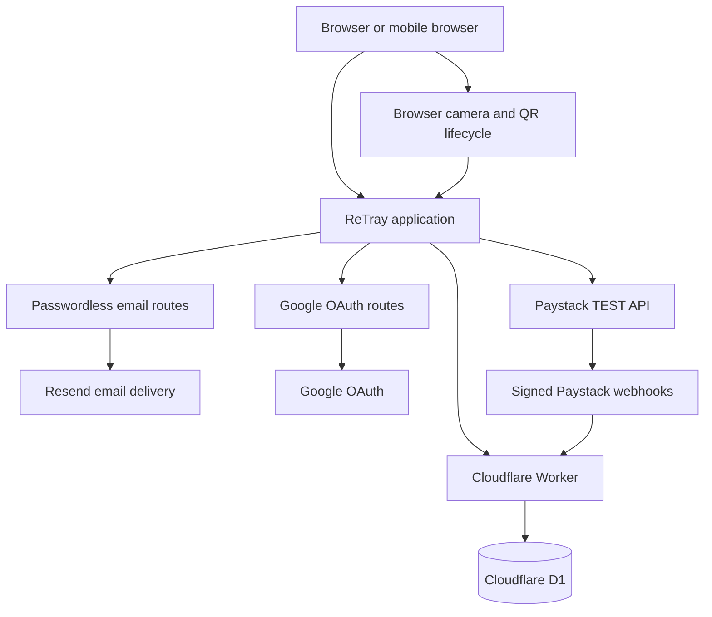

# ReTray

Reusable packaging infrastructure for food venues.

ReTray lets venues issue, track, recover, refund, wash, and recirculate reusable takeaway containers. Consumers can see and return the containers they borrowed, while each venue retains ownership of its own operating loop.

**Deployed app:** [retray.solutiono1.workers.dev](https://retray.solutiono1.workers.dev)

**Repository:** [github.com/solutionkanu12/retray](https://github.com/solutionkanu12/retray)

## The Problem

Disposable takeaway packaging creates repeated waste. A reusable-container program only works when a venue can answer six operational questions: which container is out, who has it, whether its deposit was paid, whether it returned, whether it is ready to wash, and whether it can re-enter circulation.

## The Product

ReTray keeps that loop explicit:

1. A Business operator registers a QR-tagged container.
2. The venue issues it to a verified Consumer with an expected refundable NGN deposit where appropriate.
3. The Consumer sees the container, venue, deposit, and return state in their account.
4. The Consumer returns it by camera QR scan or manual QR payload.
5. A returned and paid Paystack TEST deposit can be refunded by the owning Business operator.
6. The operator marks the container ready to wash, then washed and available to issue again.

The current Paystack integration is TEST mode only and uses test money. ReTray does not provide live payment settlement.

## How It Works

### Business

- Uses a verified Business account and owns its venue and container pool.
- Creates and manages venues, registers containers, and issues containers to verified Consumers.
- Assigns an expected refundable NGN deposit when issuing a container.
- Tracks available, borrowed, returned, and ready-to-wash lifecycle states.
- Requests eligible Paystack TEST refunds and marks returned containers ready to wash.

### Consumer

- Uses a verified Consumer account and sees only their own borrowed containers.
- Sees the venue, container, deposit, return, payment, and refund state for each borrow.
- Can start a Paystack TEST deposit payment where the issued NGN deposit requires it.
- Returns an active container with a browser camera QR scan or manual QR payload.

## Architecture



Browser redirects are not authoritative for money state. A payment or refund becomes authoritative only after a verified Paystack provider outcome is processed server-side. Container, borrow, payment, refund, authentication, and lifecycle records persist in production D1.

## Lifecycle

```text
Available -> Borrowed -> Returned -> Ready to wash -> Available
          issued      returned    ready_to_wash    washed
```

Each registered container has a persisted QR ID. A camera scan or manual QR payload resolves that ID, then the server checks the authenticated Consumer's active borrow or the authenticated Business operator's venue ownership before accepting a lifecycle action.

## Authentication

- Passwordless email verification and sign-in links expire after 15 minutes and can be consumed once.
- Google OAuth uses a server-side authorization-code exchange.
- A Google identity with an existing verified ReTray email links to that account instead of creating a duplicate user.
- Account roles are Consumer or Business operator and remain fixed after signup.
- Protected `/app` access requires a signed-in, verified account.
- Sessions use opaque HttpOnly cookies whose token digests are stored in D1.

## Payments and Refunds

ReTray currently integrates Paystack TEST mode only. It uses test money and does not process live payments or financial settlement.

The deployed proof includes:

- One NGN 1,000 Paystack TEST deposit.
- One verified `charge.success` webhook that set the deposit to paid.
- A returned-container eligibility check before a refund request.
- Exactly one Paystack TEST refund.
- One verified `refund.processed` webhook that set the deposit to refunded.
- Payment, refund, and webhook duplicate protection.

The browser return from Paystack is never trusted as a payment or refund completion signal. Verified provider and webhook outcomes are the payment truth boundary.

## QR and Mobile Flow

- Camera access starts only after a person selects Start camera.
- Retained physical-phone evidence confirms HTTPS camera scanning and QR resolution for a persisted ReTray container.
- Invalid or foreign QR values fail safely without changing the lifecycle.
- Denied camera permission fails safely and leaves the manual QR fallback available.
- Manual QR payload entry resolves the same persisted container path as a camera scan.

ReTray is a browser application, not a native mobile app.

## Security

- Server actions enforce account role, venue ownership, and Consumer borrow scoping.
- Passwordless tokens, OAuth state, and OAuth nonce values are opaque, single-use, and time-bounded.
- Google OAuth exchanges authorization codes on the server and validates the resulting identity.
- Email verification records token consumption before an account is verified.
- Paystack webhook signatures are verified before payment or refund state changes.
- Payment and refund records use idempotency and processed-event digests to protect against duplicates.
- Secret values stay outside Git in local `.dev.vars` files or Worker secrets.
- Browser navigation cannot complete a financial state change.

See [SECURITY.md](SECURITY.md) for the product's authentication, data, payment, and truthfulness boundaries.

## Production Evidence

| Area | Evidence |
| --- | --- |
| Deployment | [retray.solutiono1.workers.dev](https://retray.solutiono1.workers.dev) |
| Production database | Cloudflare D1 persisted records |
| Passwordless authentication | Verified deployed, 15-minute single-use links |
| Google OAuth | Verified deployed account linking and sign-in |
| Consumer and Business scoping | Verified role and ownership checks |
| Mobile QR camera | Verified on a physical phone with retained evidence |
| Paystack payment | TEST mode, verified `charge.success` webhook |
| Paystack refund | TEST mode, verified `refund.processed` webhook |
| Tests | `pnpm test` passes |
| Lint | Passing |
| TypeScript | Passing |
| Build | Passing |

## Tech Stack

- TypeScript, React, Next, Vinext, and Vite
- Cloudflare Workers and Cloudflare D1
- Drizzle ORM with D1 migrations
- Resend for passwordless email delivery
- Google OAuth
- Paystack TEST API and signed webhooks
- Browser `MediaDevices` and `BarcodeDetector` APIs for QR scanning

## Local Development

Requirements: Node.js 22.13 or later and pnpm.

```sh
git clone https://github.com/solutionkanu12/retray.git
cd retray
pnpm install
cp .env.example .dev.vars
pnpm build
pnpm start
```

The full local Worker path uses the ignored `.dev.vars` file and the local D1 state configured by the start script. The supplied example uses `http://127.0.0.1:8787` as its local Worker base URL. For interface iteration, run `pnpm dev`; use the full Worker path when exercising authentication, D1, or provider routes.

## Environment

Copy `.env.example` to the ignored `.dev.vars` file for local Worker testing. The application reads these names:

| Variable | Purpose | Classification |
| --- | --- | --- |
| `APP_BASE_URL` | Canonical application origin and OAuth callback base | Non-secret configuration |
| `RESEND_API_KEY` | Resend email delivery credential | Secret |
| `RESEND_FROM_EMAIL` | Verified sender address | Non-secret configuration |
| `GOOGLE_CLIENT_ID` | Google OAuth client identifier | Non-secret configuration |
| `GOOGLE_CLIENT_SECRET` | Google OAuth credential | Secret |
| `PAYSTACK_PUBLIC_KEY` | Paystack TEST browser key | Non-secret TEST configuration |
| `PAYSTACK_SECRET_KEY` | Paystack TEST server credential and webhook verification key | Secret |

Use equivalent secret configuration in Cloudflare Workers for deployed environments. Never commit `.dev.vars` or production credential values.

## Testing

```sh
pnpm test
pnpm lint
pnpm exec tsc --noEmit
pnpm build
```

See [docs/TESTING.md](docs/TESTING.md) for the manual verification checklist.

## Repository Structure

```text
app/          routes, protected app entry, server actions, and provider endpoints
components/   Business, Consumer, QR, landing, and legal interfaces
db/           D1 connection and Drizzle schema
drizzle/      versioned D1 migrations
lib/          authentication, lifecycle, payments, provider, and QR domain logic
docs/         architecture, testing, submission, and research notes
scripts/      local Worker and build utilities
tests/        authentication, lifecycle, payment, QR, and integration coverage
public/       static application assets
```

## Deployment

The deployed application runs on Cloudflare Workers with production Cloudflare D1 persistence: [retray.solutiono1.workers.dev](https://retray.solutiono1.workers.dev).

The repository includes the Worker configuration in `wrangler.jsonc` and versioned D1 migrations in `drizzle/`. An authorized release operator builds the application with `pnpm build` before deploying through the configured Cloudflare Worker environment. Deployment credentials, Worker secrets, and database migration operations are intentionally not embedded in this repository.

## Status

ReTray is a deployed working prototype and hackathon build of a reusable packaging circulation system. The current deployed proof covers the venue-to-Consumer loop, persisted state, authentication, QR lifecycle, and Paystack TEST deposit and refund flow. Paystack TEST uses test money only.
