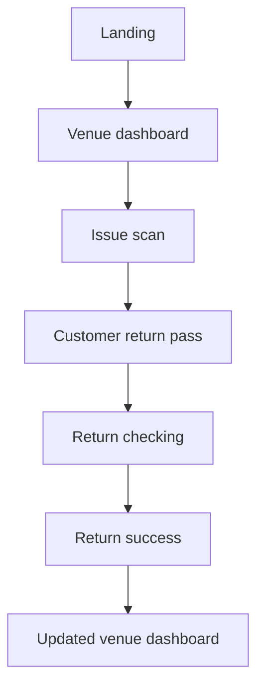

# Prototype Architecture

## Application model

The application is intentionally frontend-only. The visible journey is driven by a reducer so the business proof is deterministic and testable.

## Boundaries

| Layer | Responsibility |
| --- | --- |
| `components/` | Accessible visual surfaces and user actions |
| `lib/journey-model.ts` | Shared RT-024, Maya L., Kora Kitchen, and EUR 3.00 demo contract |
| `lib/retray-state.ts` | Reducer that changes the container, metrics, and view state |
| `tests/` | Proves navigation and circulation updates |
| `app/globals.css` | Design tokens, layout, responsive behavior, and motion |

No API, database, authentication service, payment provider, scanner, or personal data store is present.
