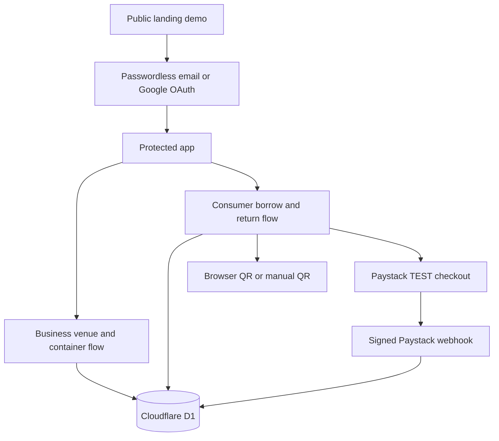

# Hackathon Deployment Architecture

## Application model

The public landing presents a deterministic Kora Kitchen demo fixture. Its View demo action opens the protected product. The authenticated product runs on Cloudflare Workers with Cloudflare D1 persistence for accounts, venues, containers, borrows, circulation events, payment attempts, refunds, and processed webhook events.

## Boundaries

| Layer | Responsibility |
| --- | --- |
| `components/` | Accessible public, Business, Consumer, camera, and legal surfaces |
| `app/api/auth/` | Passwordless email-link and Google OAuth routes |
| `app/api/paystack/` | Paystack TEST checkout initialization and signed webhook receipt |
| `lib/retray-data.ts` | D1 venue, container, borrow, circulation, payment, refund, and webhook operations |
| `lib/journey-model.ts` and `lib/retray-state.ts` | RT-024, Maya L., Kora Kitchen, and EUR 3.00 landing-demo contract |
| `tests/` | Auth, role, circulation, payment, webhook, QR, and landing integrity coverage |
| `app/globals.css` | Design tokens, layout, responsive behavior, and motion |

Email links are single-use and expire after 15 minutes. Google OAuth resolves a matching email to the existing ReTray account. Browser QR frames are decoded locally and are not stored as images. Paystack uses TEST mode and test money only. Browser payment returns never change a payment state; verified signed webhooks do.
